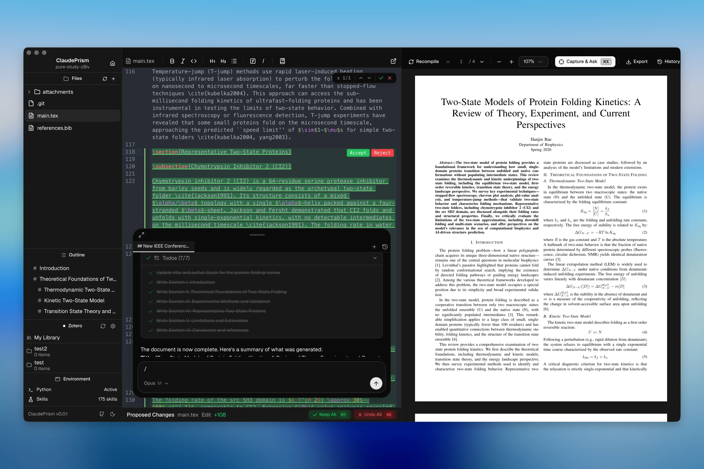
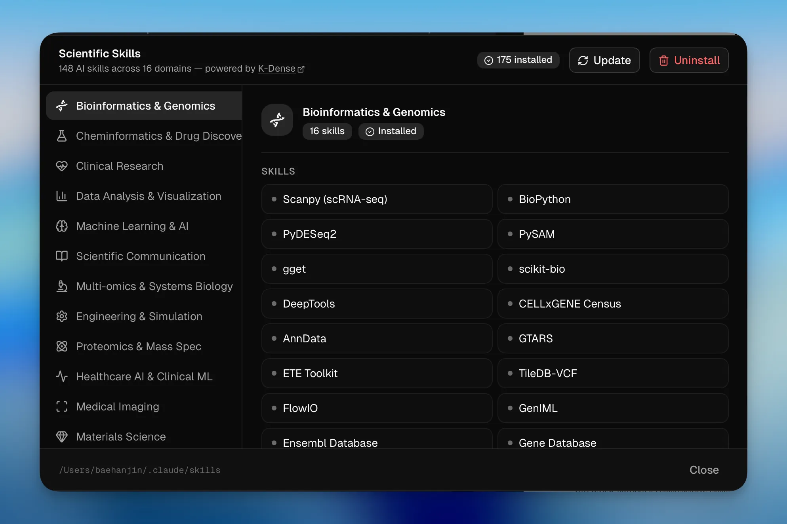
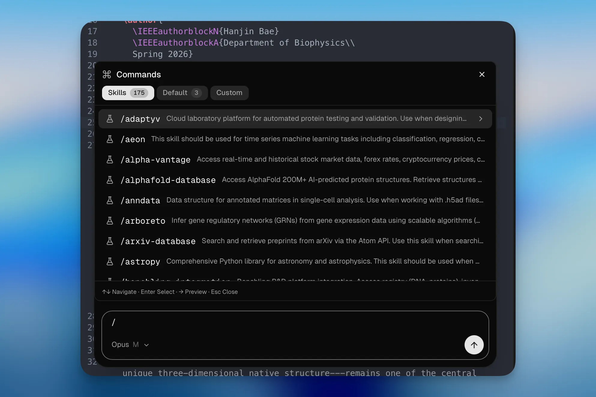
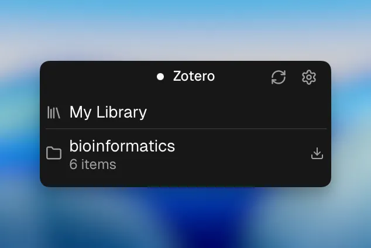

  

<h1 align="center">LATEX-LABS</h1>

  Claude 기반의 오프라인 우선 과학 논문 작성 워크스페이스. 
  LaTeX + Python + 100개 이상의 과학 스킬 — 데스크톱에서 실행됩니다.

  <a href="./README.md">English</a> ·
  <a href="./README.ko.md">한국어</a> ·
  <a href="./README.ja.md">日本語</a> ·
  <a href="./README.zh-CN.md">简体中文</a>

  

  &nbsp;
  &nbsp;
  &nbsp;
  &nbsp;
  

  

---

## 왜 LATEX-LABS인가?

[OpenAI Prism](https://openai.com/prism/)은 클라우드 기반 LaTeX 워크스페이스입니다 — 사용하려면 모든 파일과 데이터를 OpenAI 서버에 업로드해야 합니다.

LATEX-LABS은 **로컬 우선** 대안입니다 — 파일은 로컬 디스크에 저장하고 오프라인으로 컴파일합니다. AI 기능은 Anthropic API로 콘텐츠를 전송하여 추론합니다 ([데이터 사용 정책](https://code.claude.com/docs/en/data-usage) 참고).

| | OpenAI Prism | LATEX-LABS |
|---|:---:|:---:|
| AI 모델 | GPT-5.2 | **Claude Opus / Sonnet / Haiku** |
| 실행 환경 | 브라우저 (클라우드) | **네이티브 데스크톱 (Tauri 2 + Rust)** |
| LaTeX | 클라우드 컴파일 | **Tectonic (내장, 오프라인)** |
| Python 환경 | — | **내장 uv + venv — 원클릭 과학 Python 환경** |
| 과학 스킬 | — | **100+ 도메인 스킬 (생물정보학, 화학정보학, ML 등)** |
| 시작하기 | 계정 설정 필요 | **설치 후 바로 사용 — 템플릿 갤러리 + 프로젝트 마법사** |
| 버전 관리 | — | **Git 기반 히스토리 (라벨 & diff)** |
| 소스 코드 | 프로프라이어터리 | **오픈소스 (MIT)** |

### 데이터 및 개인정보

문서는 로컬에 저장·컴파일되며 원격 서버에 업로드되지 않습니다. 단, AI 기능 사용 시 **프롬프트와 Claude가 읽은 파일 내용이 Anthropic API로 전송됩니다**. 이는 모든 클라우드 기반 LLM 도구와 동일합니다. 보존 정책 및 opt-out 옵션은 [Claude Code 데이터 사용 정책](https://code.claude.com/docs/en/data-usage)을 참고하세요.

---

## 기능

### Python 환경 (uv)
LATEX-LABS은 빠른 Python 패키지 관리자인 [uv](https://docs.astral.sh/uv/)를 앱에 직접 통합합니다. 원클릭으로 uv 설치, 원클릭으로 프로젝트 수준 가상 환경 생성. Claude Code가 Python 코드 실행 시 `.venv`를 자동으로 사용하므로, 에디터를 떠나지 않고 플롯 생성, 분석 스크립트 실행, 데이터 처리가 가능합니다.

  

### 100+ 과학 스킬
[K-Dense Scientific Skills](https://github.com/K-Dense-AI/claude-scientific-skills)에서 도메인별 스킬을 탐색하고 설치하세요 — Claude에게 전문 분야의 심층 지식을 부여하는 큐레이션된 프롬프트와 도구 설정입니다:

| 도메인 | 스킬 |
|--------|--------|
| **생물정보학 & 유전체학** | Scanpy, BioPython, PyDESeq2, PySAM, gget, AnnData, ... |
| **화학정보학 & 신약 개발** | RDKit, DeepChem, DiffDock, PubChem, ChEMBL, ... |
| **데이터 분석 & 시각화** | Matplotlib, Seaborn, Plotly, Polars, scikit-learn, ... |
| **머신러닝 & AI** | PyTorch Lightning, Transformers, SHAP, UMAP, PyMC, ... |
| **임상 연구** | ClinicalTrials.gov, ClinVar, DrugBank, FDA, ... |
| **과학 커뮤니케이션** | 문헌 리뷰, 연구비 작성, 인용 관리, ... |
| **다중 오믹스 & 시스템 생물학** | scvi-tools, COBRApy, Reactome, Bioservices, ... |
| **기타** | 재료 과학, 실험실 자동화, 프로테오믹스, 물리학, ... |

스킬은 전역(`~/.claude/skills/`) 또는 프로젝트별로 설치되며, Claude가 관련 시점에 자동으로 로드합니다.

  

### 템플릿 & 프로젝트 마법사로 빠른 시작
템플릿(논문, 학위 논문, 프레젠테이션, 포스터, 서신 등)을 선택하고 이름을 지정한 후, 선택적으로 작성 내용을 설명하면 — LATEX-LABS이 프로젝트를 설정하고 AI로 초기 콘텐츠를 생성합니다. 참고 파일(PDF, BIB, 이미지)을 드래그 앤 드롭하여 바로 작성을 시작하세요.

  

### Claude AI 어시스턴트
에디터에서 Claude와 직접 대화하세요. Sonnet, Opus, Haiku 모델 중 선택하고 추론 노력 수준을 조절할 수 있습니다. 영속적 세션, 도구 사용(파일 편집, bash, 검색), 확장 가능한 슬래시 명령어를 지원합니다.

  

### 히스토리 & 변경 제안 검토
저장할 때마다 로컬 Git 저장소(`.latexlabs/history.git/`)에 스냅샷이 생성됩니다. 중요한 체크포인트에 라벨을 달고, 두 스냅샷 간의 diff를 탐색하고, 이전 버전을 복원할 수 있습니다. Claude가 편집을 제안하면 전용 패널에서 시각적 diff와 함께 표시되며 — 청크별로 수락/거부하거나 한 번에 모두 적용/취소(`⌘Y` / `⌘N`)할 수 있습니다.

  

### 오프라인 LaTeX 컴파일
Tectonic이 앱에 직접 내장되어 있습니다. 패키지는 처음 사용 시 한 번 다운로드되어 로컬에 캐시됩니다. 이후에는 TeX Live 설치 없이 완전히 오프라인으로 컴파일됩니다.

### 캡처 & 질문
`⌘X`를 눌러 캡처 모드에 진입하고 PDF의 원하는 영역을 드래그하면 — 캡처된 이미지가 채팅 입력창에 고정되어 바로 Claude에게 질문할 수 있습니다. 수식, 그림, 표, 리뷰어 코멘트에 대해 질문하기에 좋습니다.

  

### 실시간 PDF 미리보기
SyncTeX를 지원하는 네이티브 MuPDF 렌더링 — PDF에서 위치를 클릭하면 해당 소스 라인으로 이동합니다. 확대/축소, 텍스트 선택, 캡처를 지원합니다.

### 에디터
LaTeX/BibTeX 구문 강조, 실시간 오류 린팅, 찾기 & 바꾸기(정규식), 자동 저장이 포함된 멀티 파일 프로젝트를 지원하는 CodeMirror 6 기반입니다.

### 기타
- **Zotero 연동** — OAuth 기반 참고문헌 관리 및 인용 삽입.

  

- **슬래시 명령어** — 내장(`/review`, `/init`) + `.claude/commands/`의 커스텀 명령어.
- **외부 에디터** — Cursor, VS Code, Zed, Sublime Text에서 프로젝트 열기.
- **다크 / 라이트 테마** — 자동 전환.

---

## 설치

[GitHub Releases](https://github.com/delibae/latex-labs/releases)에서 최신 빌드를 다운로드하세요.

## 기여

기여를 환영합니다! 개발 환경 설정, 테스트, 가이드라인은 [CONTRIBUTING.md](./CONTRIBUTING.md)를 참고하세요.

## 감사의 말

이 프로젝트는 [assistant-ui](https://github.com/assistant-ui)의 [Open Prism](https://github.com/assistant-ui/open-prism)에서 시작되었습니다.

## 라이선스

[MIT](./LICENSE)
