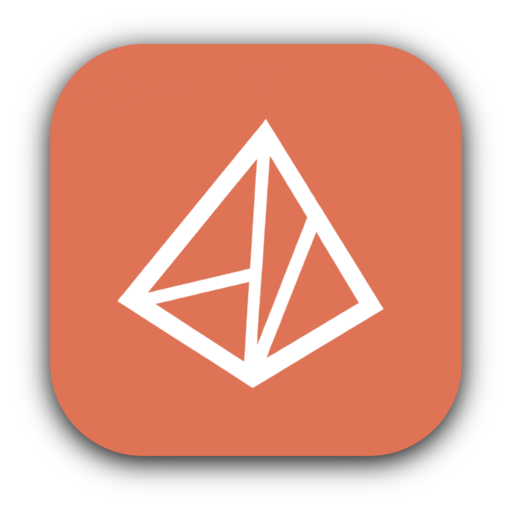
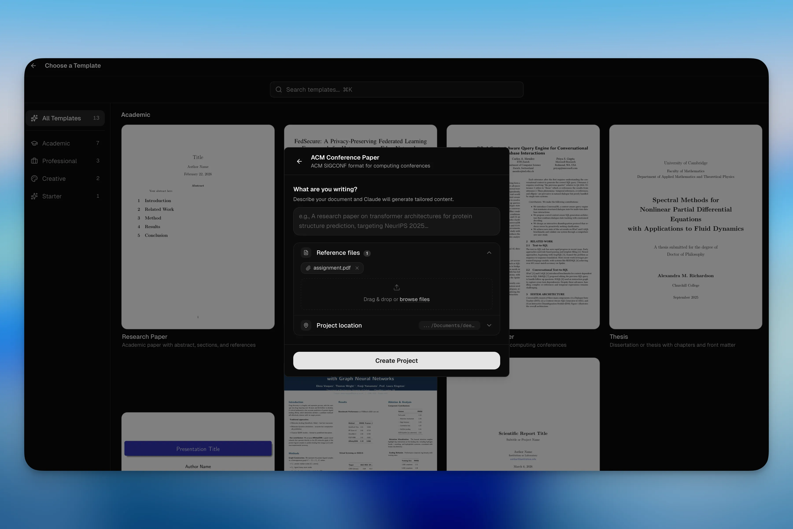

<p align="center">
  
</p>

<h1 align="center">LATEX-LABS v2</h1>

<p align="center">
  <strong>The open-source desktop IDE that puts AI, LaTeX, and your research in one place.</strong><br/>
  Local-first. Dual AI (Claude + Codex). 100+ scientific skills. Offline compilation.
</p>

<p align="center">
  <a href="./README.md">English</a> ·
  <a href="./README.ko.md">한국어</a> ·
  <a href="./README.ja.md">日本語</a> ·
  <a href="./README.zh-CN.md">简体中文</a>
</p>

<p align="center">
  
</p>

<p align="center">
  <a href="https://github.com/warpirate/latex-labs-v2/releases/latest/download/LATEX-LABS-macOS.dmg">
    
  </a>&nbsp;
  <a href="https://github.com/warpirate/latex-labs-v2/releases/latest/download/LATEX-LABS-macOS-Intel.dmg">
    
  </a>&nbsp;
  <a href="https://github.com/warpirate/latex-labs-v2/releases/latest/download/LATEX-LABS-Windows-setup.exe">
    
  </a>&nbsp;
  <a href="https://github.com/warpirate/latex-labs-v2/releases/latest/download/LATEX-LABS-Linux.AppImage">
    
  </a>
</p>

<p align="center">
  <a href="https://github.com/warpirate/latex-labs-v2/releases">
    
  </a>
  
  
</p>

---

## Why LATEX-LABS?

Most LaTeX tools make you choose: cloud convenience **or** local control. LATEX-LABS gives you both — a polished desktop IDE with two interchangeable AI assistants, live compilation, and deep scientific domain knowledge. Your files never leave your machine. AI features call Anthropic or OpenAI APIs only when you invoke them.

| | Cloud LaTeX tools | LATEX-LABS |
|---|:---:|:---:|
| Where files live | Their servers | **Your disk** |
| Compilation | Cloud | **Local (Tectonic, offline)** |
| AI Models | Single provider | **Claude (Opus / Sonnet / Haiku) + Codex (o3 / o4-mini / GPT-4.1)** |
| Python | Not available | **Built-in uv + venv** |
| Scientific Skills | Not available | **100+ domain skill packs** |
| Version Control | Cloud-managed | **Local Git history with diffs** |
| Source | Proprietary | **Open source (MIT)** |

---

## Features

### Editor + Live PDF Preview

CodeMirror 6 with LaTeX/BibTeX syntax highlighting, real-time error linting, and auto-save. The PDF panel renders via native MuPDF with **SyncTeX** — click anywhere in the PDF to jump to the corresponding source line, and vice versa. Supports zoom, text selection, and multiple compilation engines (Tectonic, pdflatex, xelatex, lualatex).

<p align="center">
  
</p>

---

### Dual AI Backend — Claude Code + Codex

Switch between **two AI providers** mid-session from the same chat interface:

| Provider | CLI | Models |
|----------|-----|--------|
| **Anthropic** | Claude Code CLI | Opus, Sonnet, Haiku (adjustable reasoning effort) |
| **OpenAI** | Codex CLI | o3, o4-mini, GPT-4.1 |

Both can edit your files, run shell commands, and search your project. Pin files with `@file:path` syntax for context. When the AI suggests edits, a **proposed changes panel** shows visual diffs — accept or reject each chunk, or use `⌘Y` / `⌘N` to apply/undo all at once. Token usage and cost are tracked per message.

<p align="center">
  
</p>

---

### Capture & Ask

Press **`⌘X`** to enter capture mode. Drag to select any region in the PDF — the screenshot is pinned to the chat so you can ask the AI about equations, figures, tables, or reviewer comments. Five vision modes: **Equation**, **Table**, **Figure**, **Algorithm**, and **OCR**.

<p align="center">
  
</p>

---

### 100+ Scientific Skills

Install domain-specific skill packs that give the AI deep, specialized knowledge:

| Domain | Examples |
|--------|----------|
| Bioinformatics & Genomics | Scanpy, BioPython, PyDESeq2, PySAM, gget, AnnData |
| Cheminformatics & Drug Discovery | RDKit, DeepChem, DiffDock, PubChem, ChEMBL |
| Data Analysis & Visualization | Matplotlib, Seaborn, Plotly, Polars, scikit-learn |
| Machine Learning & AI | PyTorch Lightning, Transformers, SHAP, UMAP, PyMC |
| Clinical Research | ClinicalTrials.gov, ClinVar, DrugBank, FDA |
| Scientific Communication | Literature Review, Grant Writing, Citation Management |

Skills install globally (`~/.claude/skills/`) or per-project and load automatically when relevant.

<p align="center">
  
</p>

---

### History & Version Control

Every save creates a Git snapshot in `.latexlabs/history.git/`. Label important checkpoints, browse diffs between any two versions, and restore previous states — all without touching `git` yourself. Snapshot types include auto-save, manual, compile, and before-Claude markers.

<p align="center">
  
</p>

---

### Python Environment

One-click [uv](https://docs.astral.sh/uv/) installation and project-level virtual environment setup. Both Claude Code and Codex automatically use `.venv` when running Python — generate plots, run analysis scripts, and process data without leaving the app.

<p align="center">
  
</p>

---

### Project Templates

Pick from **paper, thesis, presentation, poster, letter, book, report, and CV** templates. Optionally describe what you're writing and let AI generate the initial structure. Drag & drop PDFs, BIB files, and images as references.

<p align="center">
  
</p>

---

### And More

| Feature | Description |
|---------|-------------|
| **Zotero Integration** | OAuth-based bibliography management — browse collections, import to BibTeX, insert `\cite{}` |
| **ArXiv Search** | Search papers, preview abstracts, generate BibTeX, download sources |
| **Vision Panel** | Analyze images with AI — equations, tables, figures, OCR |
| **Chart Generation** | Convert `\begin{tabular}` data into bar, line, scatter, pie, or heatmap charts via AI |
| **Template Transfer** | AI-powered format conversion between LaTeX templates |
| **Collaboration** | WebSocket-based real-time session sharing with invite links |
| **Slash Commands** | Built-in (`/review`, `/init`) + custom commands from `.claude/commands/` |
| **External Editors** | Open projects in VS Code, Cursor, Zed, or Sublime Text |
| **Dark / Light Theme** | Automatic or manual switching |

---

## Tech Stack

| Layer | Technology |
|-------|-----------|
| Framework | Tauri 2 (Rust backend) |
| Frontend | React 19, TypeScript, Vite 6 |
| Editor | CodeMirror 6 |
| PDF | MuPDF (native) + SyncTeX |
| State | Zustand 5 |
| Styling | Tailwind CSS 4 |
| LaTeX | Tectonic / pdflatex / xelatex / lualatex |
| Version Control | libgit2 (via git2-rs) |
| AI (Anthropic) | Claude Code CLI |
| AI (OpenAI) | Codex CLI |
| Python | uv + venv |
| Monorepo | Turborepo + pnpm |

---

## Getting Started

1. **Download** the installer for your platform from [Releases](https://github.com/warpirate/latex-labs-v2/releases)
2. **Launch** LATEX-LABS and create or open a project
3. **Install AI** — [Claude Code CLI](https://docs.anthropic.com/en/docs/claude-code) and/or [Codex CLI](https://github.com/openai/codex) to enable AI features
4. **Start writing** — the editor, PDF preview, and AI are ready

### Building from Source

```bash
git clone https://github.com/warpirate/latex-labs-v2.git
cd latex-labs-v2
pnpm install
pnpm dev:desktop
```

Requires: Node.js 18+, pnpm, Rust toolchain, and [Tauri prerequisites](https://v2.tauri.app/start/prerequisites/).

---

## Data & Privacy

LATEX-LABS stores and compiles everything locally. Nothing is uploaded for storage. When you use AI features, prompts and file contents are sent to Anthropic or OpenAI APIs for inference. See [Claude Code data usage](https://code.claude.com/docs/en/data-usage) for retention policies.

---

## Contributing

See [CONTRIBUTING.md](./CONTRIBUTING.md) for development setup and guidelines.

## Acknowledgments

Forked from [LATEX-LABS](https://github.com/delibae/latex-labs) by [delibae](https://github.com/delibae), originally built on [Open Prism](https://github.com/assistant-ui/open-prism) by [assistant-ui](https://github.com/assistant-ui).

## License

[MIT](./LICENSE)
