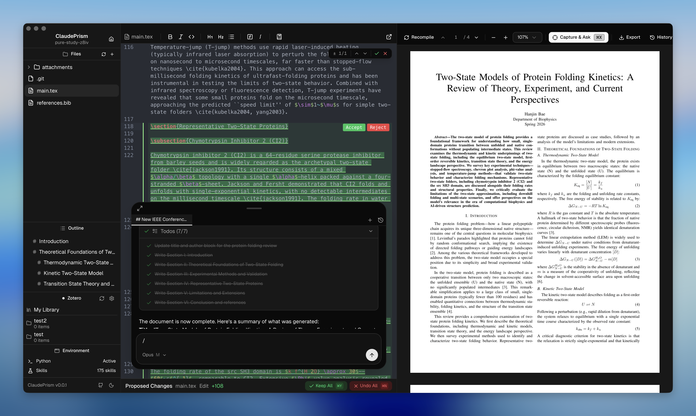

  

<h1 align="center">LATEX-LABS</h1>

  由 Claude 驱动的离线优先科学写作工作区。 
  LaTeX + Python + 100 多个科学技能 — 在桌面端运行。

  <a href="./README.md">English</a> ·
  <a href="./README.ko.md">한국어</a> ·
  <a href="./README.ja.md">日本語</a> ·
  <a href="./README.zh-CN.md">简体中文</a>

  

  <a href="https://latexlabs.delibae.dev?utm_source=github&utm_medium=readme&utm_campaign=launch_v054">官网</a> ·
  <a href="https://github.com/delibae/latex-labs/releases/latest/download/LATEX-LABS-macOS.dmg">macOS (Apple Silicon)</a> ·
  <a href="https://github.com/delibae/latex-labs/releases/latest/download/LATEX-LABS-macOS-Intel.dmg">macOS (Intel)</a> ·
  <a href="https://github.com/delibae/latex-labs/releases/latest/download/LATEX-LABS-Windows-setup.exe">Windows</a> ·
  <a href="https://github.com/delibae/latex-labs/releases/latest/download/LATEX-LABS-Linux.AppImage">Linux</a> ·
  <a href="https://github.com/delibae/latex-labs/releases">所有版本</a>

---

## 为什么选择 LATEX-LABS？

[OpenAI Prism](https://openai.com/prism/) 是一个云端 LaTeX 工作区 — 使用它需要将所有文件和数据上传到 OpenAI 的服务器。

LATEX-LABS 是**本地优先**的替代方案 — 文件存储在本地磁盘，离线编译。AI 功能通过 Anthropic API 发送内容进行推理（参见[数据使用政策](https://code.claude.com/docs/en/data-usage)）。

| | OpenAI Prism | LATEX-LABS |
|---|:---:|:---:|
| AI 模型 | GPT-5.2 | **Claude Opus / Sonnet / Haiku** |
| 运行环境 | 浏览器（云端） | **原生桌面应用（Tauri 2 + Rust）** |
| LaTeX | 云端编译 | **Tectonic（内嵌，离线）** |
| Python 环境 | — | **内置 uv + venv — 一键科学 Python 环境** |
| 科学技能 | — | **100+ 领域技能（生物信息学、化学信息学、ML 等）** |
| 快速开始 | 需要注册账户 | **安装即用 — 模板库 + 项目向导** |
| 版本控制 | — | **基于 Git 的历史记录，支持标签和差异对比** |
| 源代码 | 专有 | **开源（MIT）** |

### 数据与隐私

文档在本地存储和编译，不会上传到远程服务器。但使用 AI 功能时，**提示词和 Claude 读取的文件内容会发送到 Anthropic API 进行推理**，这与所有云端 LLM 工具相同。有关保留政策和退出选项，请参阅 [Claude Code 数据使用政策](https://code.claude.com/docs/en/data-usage)。

---

## 功能

### Python 环境（uv）
LATEX-LABS 集成了 [uv](https://docs.astral.sh/uv/) — 快速的 Python 包管理器。一键安装 uv，一键创建项目级虚拟环境。Claude Code 在运行 Python 代码时自动使用 `.venv`，因此您可以在编辑器中直接生成图表、运行分析脚本和处理数据。

### 100+ 科学技能
浏览并安装来自 [K-Dense Scientific Skills](https://github.com/K-Dense-AI/claude-scientific-skills) 的领域特定技能 — 精心策划的提示词和工具配置，赋予 Claude 专业领域的深度知识：

| 领域 | 技能 |
|--------|--------|
| **生物信息学与基因组学** | Scanpy、BioPython、PyDESeq2、PySAM、gget、AnnData 等 |
| **化学信息学与药物发现** | RDKit、DeepChem、DiffDock、PubChem、ChEMBL 等 |
| **数据分析与可视化** | Matplotlib、Seaborn、Plotly、Polars、scikit-learn 等 |
| **机器学习与 AI** | PyTorch Lightning、Transformers、SHAP、UMAP、PyMC 等 |
| **临床研究** | ClinicalTrials.gov、ClinVar、DrugBank、FDA 等 |
| **科学传播** | 文献综述、基金撰写、引用管理等 |
| **多组学与系统生物学** | scvi-tools、COBRApy、Reactome、Bioservices 等 |
| **更多** | 材料科学、实验室自动化、蛋白质组学、物理学等 |

技能可全局安装（`~/.claude/skills/`）或按项目安装，Claude 会在相关时自动加载。

### 模板与项目向导快速开始
选择模板（论文、学位论文、演示文稿、海报、信函等），命名，可选描述写作内容 — LATEX-LABS 设置项目并通过 AI 生成初始内容。拖放参考文件（PDF、BIB、图片）即可立即开始写作。

### Claude AI 助手
在编辑器中直接与 Claude 对话。在 Sonnet、Opus、Haiku 模型之间选择，可调节推理力度。持久会话、工具使用（文件编辑、bash、搜索）和可扩展的斜杠命令。

### 建议更改审查
当 Claude 建议编辑时，更改会以可视化差异的形式显示在专用面板中。按块接受或拒绝，或一次全部应用/撤销（`⌘Y` / `⌘N`）。在您做出决定之前，原始内容始终保留。

### 基于 Git 的历史记录
每次保存都会在本地 Git 仓库（`.latexlabs/history.git/`）中创建快照。标记重要检查点，浏览任意两个快照之间的差异，恢复以前的版本 — 全部在应用内完成。

### 离线 LaTeX 编译
Tectonic 直接嵌入应用中。包在首次使用时下载一次并本地缓存。之后编译完全离线，无需安装 TeX Live。

### 截图询问
按 `⌘X` 进入截图模式，拖动选择 PDF 中的任意区域 — 截图会固定到聊天输入框，您可以立即向 Claude 询问。非常适合询问公式、图表、表格或审稿意见。

### 实时 PDF 预览
原生 MuPDF 渲染，支持 SyncTeX — 点击 PDF 中的位置跳转到相应的源代码行。支持缩放、文本选择和截图。

### 编辑器
CodeMirror 6，支持 LaTeX/BibTeX 语法高亮、实时错误检查、查找和替换（正则表达式）以及多文件项目自动保存。

### 更多
- **Zotero 集成** — 基于 OAuth 的文献管理和引用插入。
- **斜杠命令** — 内置（`/review`、`/init`）+ 来自 `.claude/commands/` 的自定义命令。
- **外部编辑器** — 在 Cursor、VS Code、Zed 或 Sublime Text 中打开项目。
- **深色/浅色主题** — 自动切换。

---

## 安装

从 [GitHub Releases](https://github.com/delibae/latex-labs/releases) 下载最新版本。

## 贡献

欢迎贡献！请查看 [CONTRIBUTING.md](./CONTRIBUTING.md) 了解开发环境设置、测试和指南。

## 致谢

本项目基于 [assistant-ui](https://github.com/assistant-ui) 的 [Open Prism](https://github.com/assistant-ui/open-prism) 开发。

## 许可证

[MIT](./LICENSE)
